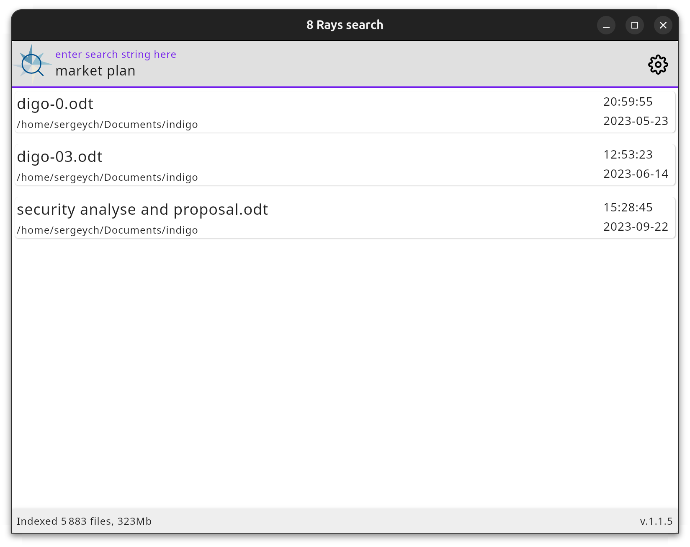

# Missing Linux GUI app to index and search file tree

> Work in progress, though it generally works.

# Search all your texts:

| search string           | meaning                                                                                |
|-------------------------|----------------------------------------------------------------------------------------|
| `foo`                   | all files where with `foo`                                                             |
| `foo bar`               | all files with foo AND bar                                                             |
| `foo bar buzz`          | all files with foo AND bar AND buzz                                                    |
| `foo bar *.txt`         | all files with extension .txt with foo AND bar                                         |
| `foo* bar`              | ...with anyting starting with foo and bar                                              |
| `f*bar`                 | could be anything between, fubar, foobar, fearbar                                      |
| `f?bar`                 | could be any single character between, fubar, febar, but _not foorbar_ (2 chars)       |
| `MIT license readme.md` | all readme.md files that cope with MIT license                                         |
| `f:myscript rendering`  | any files named `myscript` containig the `rendering` word. IT supports shebank scripts |

Raysearch scans the while user home directory for text files, and indexes them all. IT is written to walk FS in parallel
with indexing already found entries. It stores file tree metadata and reacts to changes. It is intended to be left in
the background to update indexes as the FS changes and have it ready at hand.

Results are live: whenever it scans more data, or filesystem changes, the results _might_ change. Results allow opening containing folders and files using the system defaults (using gio).

## Scanning details

On start, it rescans user home (a delta from last start) for all texts it can find, avoiding non-reasonable things like

- node moules where it detects npm/yarn usage
- build directories in yarn projects
- executable binaries (shebang scripts are ok)
- binary files that are unlikely be text: it detects valid latin-1 (ISO/IEC 8859-1) ur UTF-8, and ignores all other.
- system, hidden, dot-starting giles.
- archives, multimedia, ,any known binary data formats

I _will_ also index pdf texts (where there are) and the LibreOffice documents, I'll add it soon. With the rest - I'd appreciate some help. Don't have that much time.

## How to run

I gonna download `.deb` for installation real soon.

## Why reinwenting the wheel?

Reason d'être: I didn't find anything like, fast and neat, and grep on my software only archives takes minutes. This
thing runs in split second most often. And I don't trust clouds and googles for my work and private life: I was born in
the USSR and I am a true supporter of common sense and open source. This is enough to be banned from US/EU services
nowdays ;)

## Other stuff

8 RAYS DEV is my software development company, far enough from the crazy world, in quiet, nice and hot Tunis ;)
Welcome https://8-rays.dev. Unix rules!

## License

All this will soon receive MIT license - well, if they won't add clause agains red polo shirts or something worse. Right
now the code is useless so no license yet. Contact me if you need something particularly strange. I need some advice whether I can publish it under MIT while it uses Lucene, which is Apache.